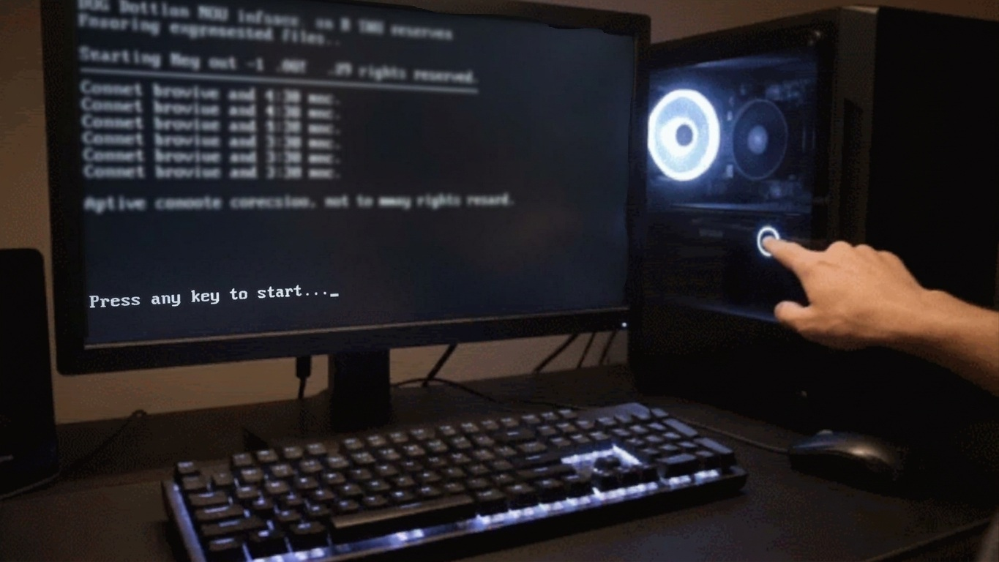

<link rel="preconnect" href="https://fonts.googleapis.com">
<link rel="preconnect" href="https://fonts.gstatic.com" crossorigin>
<link href="https://fonts.googleapis.com/css2?family=Press+Start+2P&display=swap" rel="stylesheet">

  <h2>Hello World! 👋</h2>
  
<b><em>🎓 Computer Systems Engineering student (2nd Year)</em></b>

   
  

